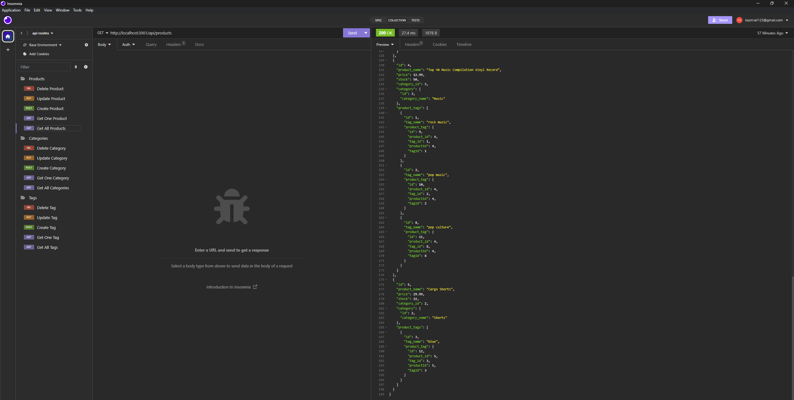

# ORM E-Commerce Back End

The Oject-Relational Mapping (ORM): E-Commerce Back End application was created to build sql tables using sequelize library in JavaScript. Also, express/restful api is used to connect http endpoints to utilize GET, POST, PUT, UPDATE, DELETE fetch requests to minipute the sql database.

## Features

- Dotenv library is used to input sensitive data to provide credentials for connecting to the mysql database.
- User is able to create a new mysql database named ecommerce_db.
- Seeding data is inserted into the database using node and seed index.js script.
- Sequelize library is then used to create models for products, categories, and tags. Also, this library's model class is used along with its methods to minupute the data base such as get a table, create/update/delete a row.
- Express Restful api is used to connects http endpoint to database methods:
  - get requests to get all products, categories, or tags
  - get request to get a single product, a category, or a tag using its id
  - post requests to create a product, a category, or a tag
  - put requests to update a product, a category, or a tag using its respective id
  - delete requests to delete a product, a category, or a tag using its respective id
  - add a new employee
  - update an employee role

## Appendix

https://www.npmjs.com/package/dotenv/v/8.2.0

https://www.npmjs.com/package/mysql2/v/2.1.0

https://www.npmjs.com/package/express/v/4.17.1

https://www.npmjs.com/package/sequelize/v/5.21.7

https://dev.mysql.com/doc/

https://aws.amazon.com/what-is/restful-api/#:~:text=RESTful%20API%20is%20an%20interface,applications%20to%20perform%20various%20tasks.

https://sequelize.org/api/v6/class/src/associations/base.js~association

https://docs.insomnia.rest/insomnia/get-started

https://coding-boot-camp.github.io/full-stack/computer-literacy/video-submission-guide

## Authors

- [Syed Kazmi](https://github.com/kazmiali123)

## Deployment

GitHub Repository: https://github.com/kazmiali123/Challange-13-ORM-E-Commerce-BackEnd

Walkthrough Video: https://drive.google.com/file/d/1XfUImrD9pyMokrJwLQjKMPp1HRibP3ah/view

## Demo

